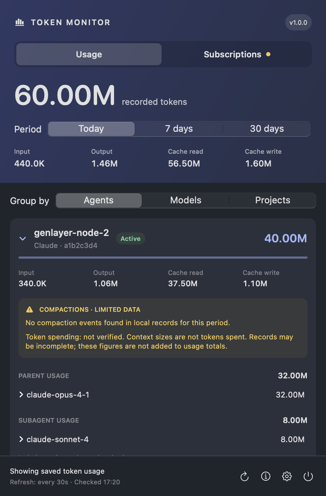
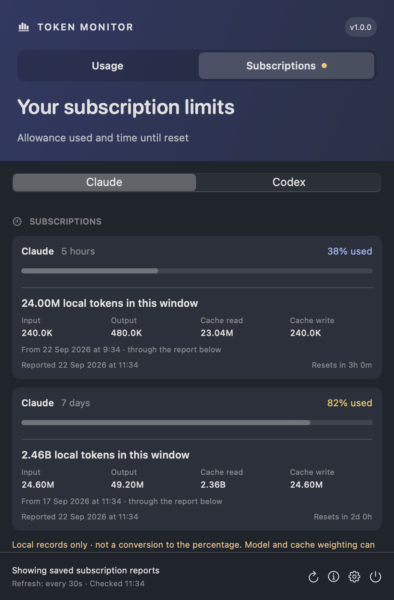
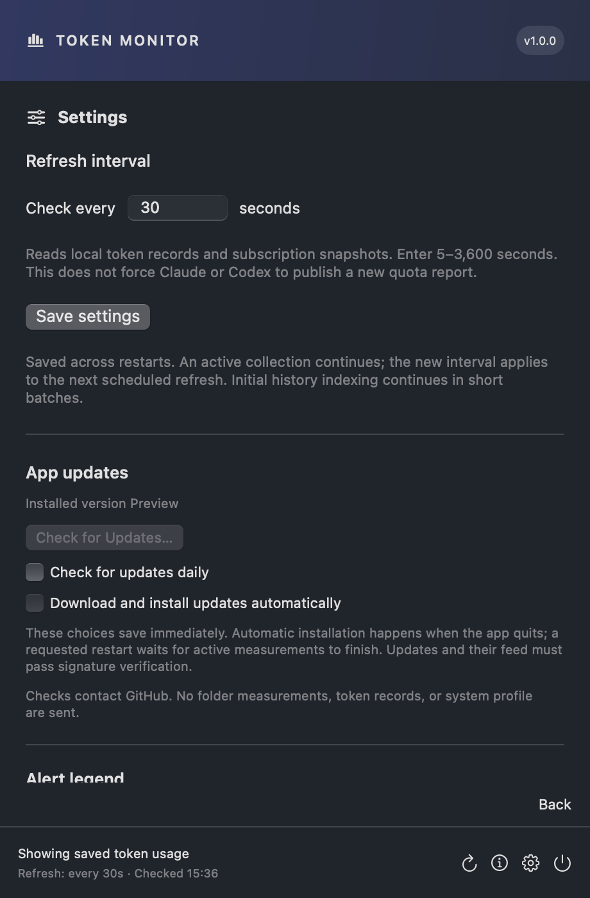

# Token Monitor

**Understand your agents’ token usage and subscription limits from the macOS menu bar.**

Token Monitor brings local Claude Code, Codex, and OpenCode usage into one native
view. Explore spending by agent, model, or project, then switch to a separate
subscription view for provider-reported allowance and reset times.

<p align="center">
  
</p>

*Current SwiftUI interface rendered with illustrative sessions, models, and token counts. These are example records, not live usage.*

## Table of contents

- [Overview](#overview)
- [Installation](#installation)
- [Usage](#usage)
- [Subscriptions and alerts](#subscriptions-and-alerts)
- [Privacy and accounting limits](#privacy-and-accounting-limits)
- [App updates](#app-updates)
- [Documentation](#documentation)
- [Contributing](#contributing)

## Overview

- **Three perspectives.** Group Today, 7-day, or 30-day usage by Agents, Models, or Projects.
- **Clear token categories.** See input, output, cache reads, and cache writes; large totals use K, M, and B.
- **Parent and subagent totals.** Completed children disappear from the active detail while their usage stays in the parent total.
- **Session-aware activity.** Active sessions sort first. Short session IDs distinguish agents that reuse a name.
- **Separate subscription reports.** Claude and Codex have their own tabs, allowance bars, reset countdowns, and menu bar warnings.
- **Compaction observations.** A yellow panel labels limited metadata without claiming it measures compaction spending.

Built with SwiftUI, AppKit, and a Python standard-library collector. **Version 1.0.0** is the first stable version. CI produces drag-to-Applications DMGs
for macOS 15+, with separate Apple Silicon and Intel downloads. Builds are ad-hoc
signed; Apple notarization and launch-at-login are not configured. Signed in-app updates are available from Settings.

## Installation

Download the DMG for your Mac from [Releases](https://github.com/dohernandez/token-monitor/releases), quit the previous copy, and drag the app into **Applications**. These builds are not Apple-notarized; see the [release and installation guide](docs/RELEASING.md).

### Build from source

Building requires macOS 15+, Apple Command Line Tools, and Python 3.9+. Downloaded apps include their own Python runtime.
The build downloads a checksum-pinned Python runtime. No third-party Python packages, API keys, or model calls are needed at runtime.

```sh
git clone https://github.com/dohernandez/token-monitor.git
cd token-monitor
python3 -m unittest -v test_collector.py test_quotas.py test_privacy.py
sh build.sh
"build/Token Monitor.app/Contents/MacOS/TokenMonitor" --self-test
codesign --verify --deep --strict "build/Token Monitor.app"
open "build/Token Monitor.app" --args --show
```

The app lives in `build/Token Monitor.app`. Run each command only after the preceding
one succeeds. For updates, follow [safe replacement and recovery](docs/DEVELOPMENT.md).

**Optional Claude subscription reporting:** run `python3 install_claude_observer.py`
after reading the [observer installation and uninstall instructions](docs/USAGE.md#subscription-windows).
This changes Claude’s status-line command while forwarding its existing footer.
Ordinary token collection does not require the observer. Codex quota reports come
from its local session logs.

## Usage

Click the chart icon in the menu bar, choose a period, and group by **Agents**,
**Models**, or **Projects**. Expand a card for its breakdown. Active agent entries
sort first; gray **Unverified** means the app cannot confirm the session is open,
not that it is definitely closed. Reusing an agent name does not merge sessions.

The footer offers **Refresh**, **Info**, **Settings**, and **Quit**. Local checks
default to every **30 seconds**, configurable from 5 to 3,600 seconds. Initial history
indexing runs in batches; totals remain partial until it completes. Click outside or
press Escape to dismiss the popup.

Parent totals include subagent usage once. Completed children stay hidden without
losing their recorded tokens. See the [usage and data guide](docs/USAGE.md) for
identity rules, model attribution, source formats, and compaction limitations.

## Subscriptions and alerts

Switch to **Subscriptions**, then **Claude** or **Codex**. Each card shows the latest
locally observed provider percentage, report time, reset countdown, and local tokens
recorded within that window.

<p align="center">
  
</p>

*Illustrative quota reports and token counts. Local tokens are not a conversion to allowance percentage. Native progress tracks appear neutral in this offscreen preview; the percentage labels show the alert colors.*

| Badge | Reported allowance used |
|---|---|
| 🔴 Red ! | **90% or more** |
| 🟡 Yellow ! | **75% to below 90%** |
| No badge | No available, unexpired report at 75% or above |

The highest warning across both providers wins. Reports older than five minutes are
marked stale and retain their last warning until the reported reset. Expired or
missing windows are **unknown**, not 0% used. Settings contains the full legend.
Refreshing local files does not force Claude or Codex to publish a new report.

## Privacy and accounting limits

The app reads local records. Optional update checks contact GitHub, without sending
usage records or a system profile. Source logs and the
OpenCode database are read-only. Its private cache at
`~/Library/Application Support/TokenMonitor/` holds usage metadata, IDs, model names,
and paths—not conversation or compaction summary text.

**Local token totals are not an account-wide bill or a measure of remaining allowance.**
They can omit other devices or missing logs and include API-funded activity or other
accounts. Models and cached tokens can carry different provider weights; overlapping
subscription windows must not be added together. Unknown model aliases remain unresolved.

No cost estimates, configurable budgets, exports, or complete account reconciliation
are provided. The [data guide](docs/USAGE.md) records the collection and coverage limits.

## App updates

Open **Settings → App updates** to check manually or enable daily checks and automatic
installation. Automatic options default off and save immediately. The app verifies
Ed25519 signatures on the feed and download before extraction; a checksum alone is
not accepted. Version 1.0.0 needs one manual upgrade to gain this feature. See the
[update and key-management guide](docs/RELEASING.md#signed-in-app-updates).

<p align="center">
  
</p>

*Settings preview; the updater is not started in this offscreen rendering.*

Cache directories are restricted to the owner (0700), with private cache files at
0600. Existing cache permissions are tightened without resetting saved data.

## Documentation

| Guide | Contents |
|---|---|
| [Usage and data](docs/USAGE.md) | Source accounting, session identity, subagents, quotas and observer setup |
| [Architecture](docs/ARCHITECTURE.md) | Components, persistence, background collection and invariants |
| [Development and recovery](docs/DEVELOPMENT.md) | Build, tests, safe updates, rollback and missing-icon diagnosis |
| [Acceptance checks](docs/ACCEPTANCE.md) | Accounting regressions and manual UI checks |
| [Agent instructions](AGENTS.md) | Rules for agents maintaining the project |
| [Releases and branch rules](docs/RELEASING.md) | Automated versions, installer verification, signing and main protection |
| [Screenshot sources](docs/screenshots/README.md) | Reproduce these previews without reading agent records |

## Contributing

Read the architecture and maintenance rules first. Preserve read-only sources,
deduplication, session identity, and parent rollups. Test accounting changes with
temporary records, and include focused validation and screenshots for UI changes.
Never commit live usage databases, transcripts, credentials, or personal settings.

Companion app: [Disk Monitor](https://github.com/dohernandez/disk-monitor).
